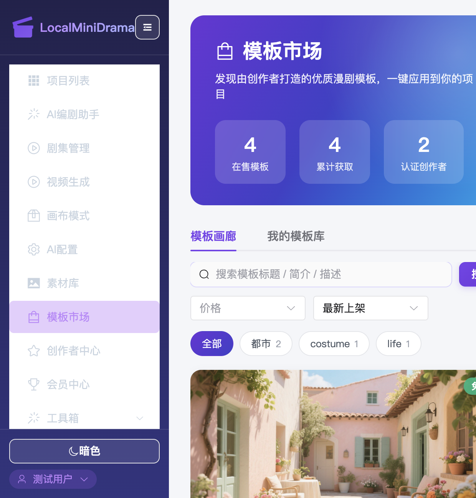
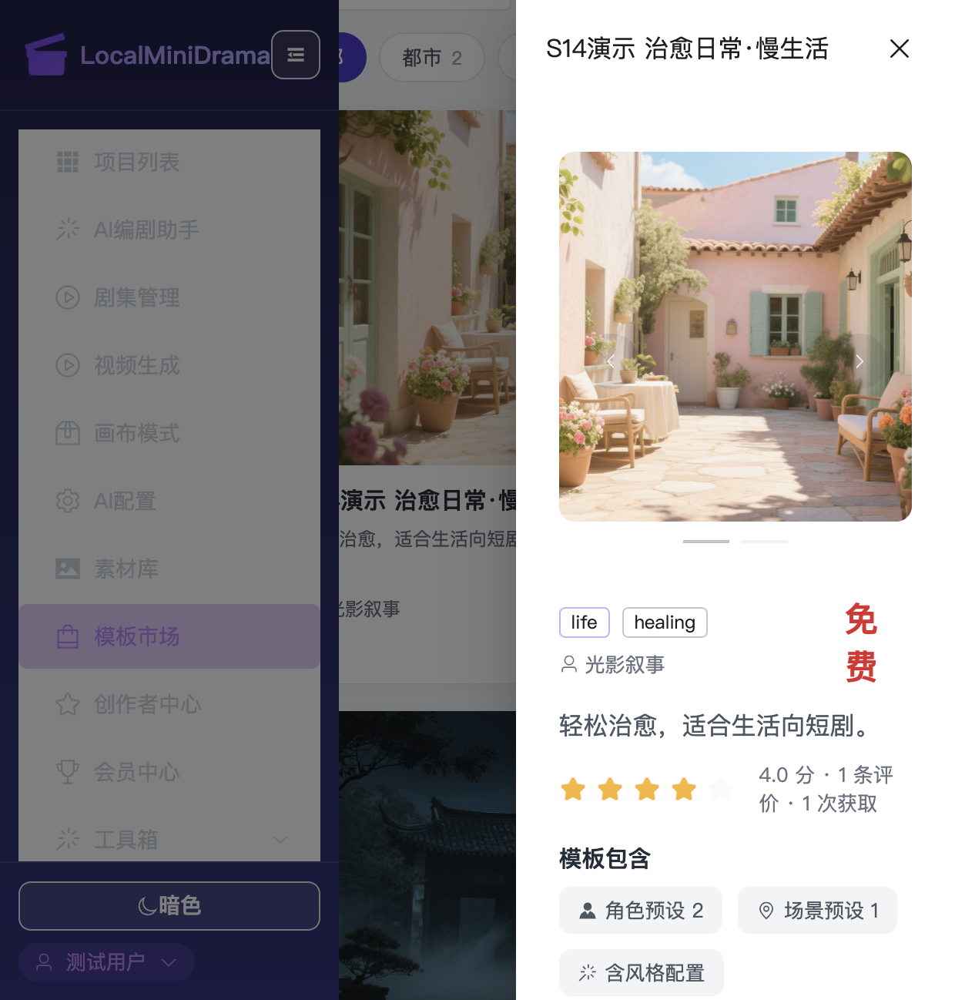
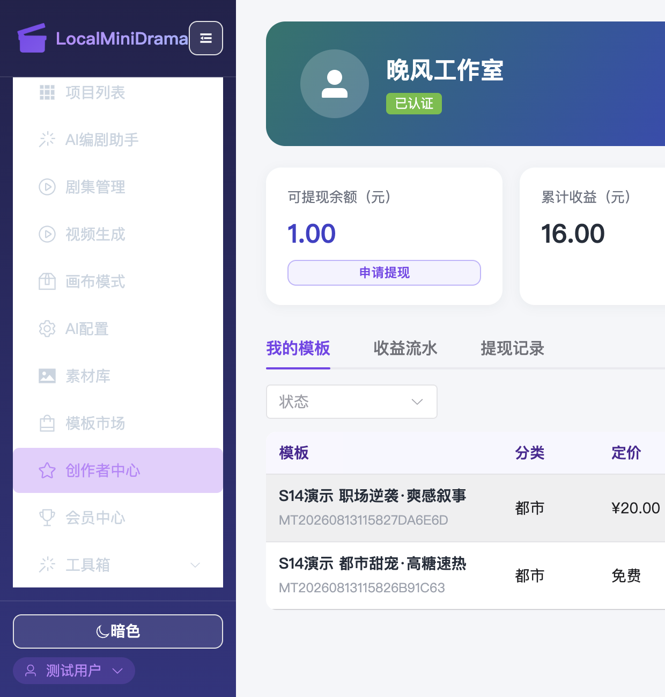
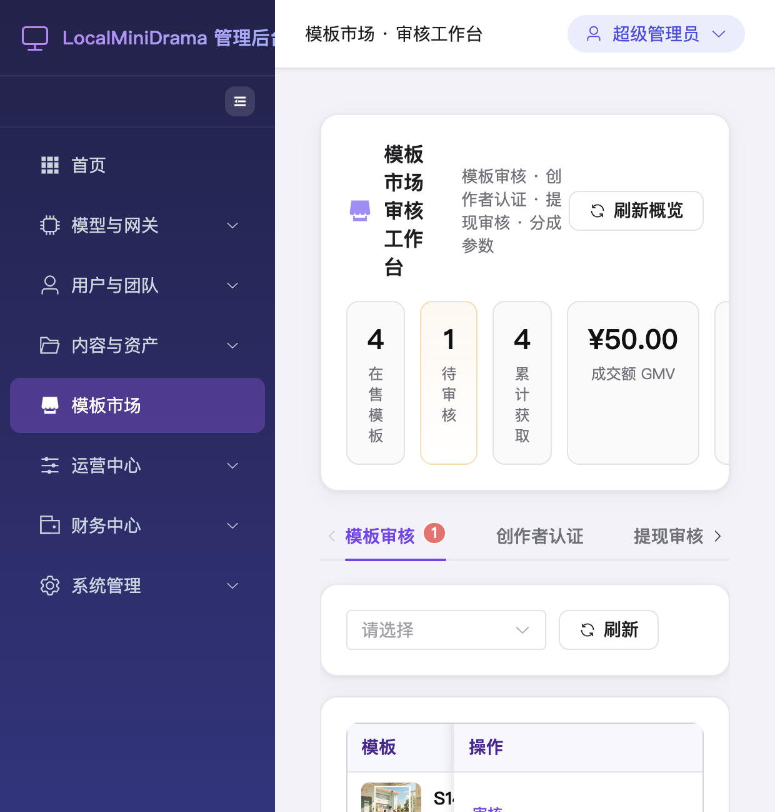
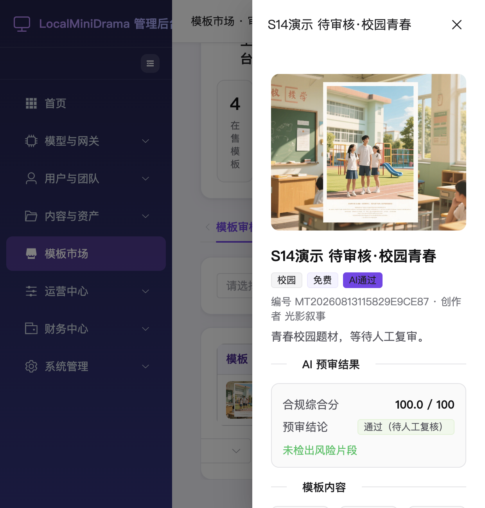
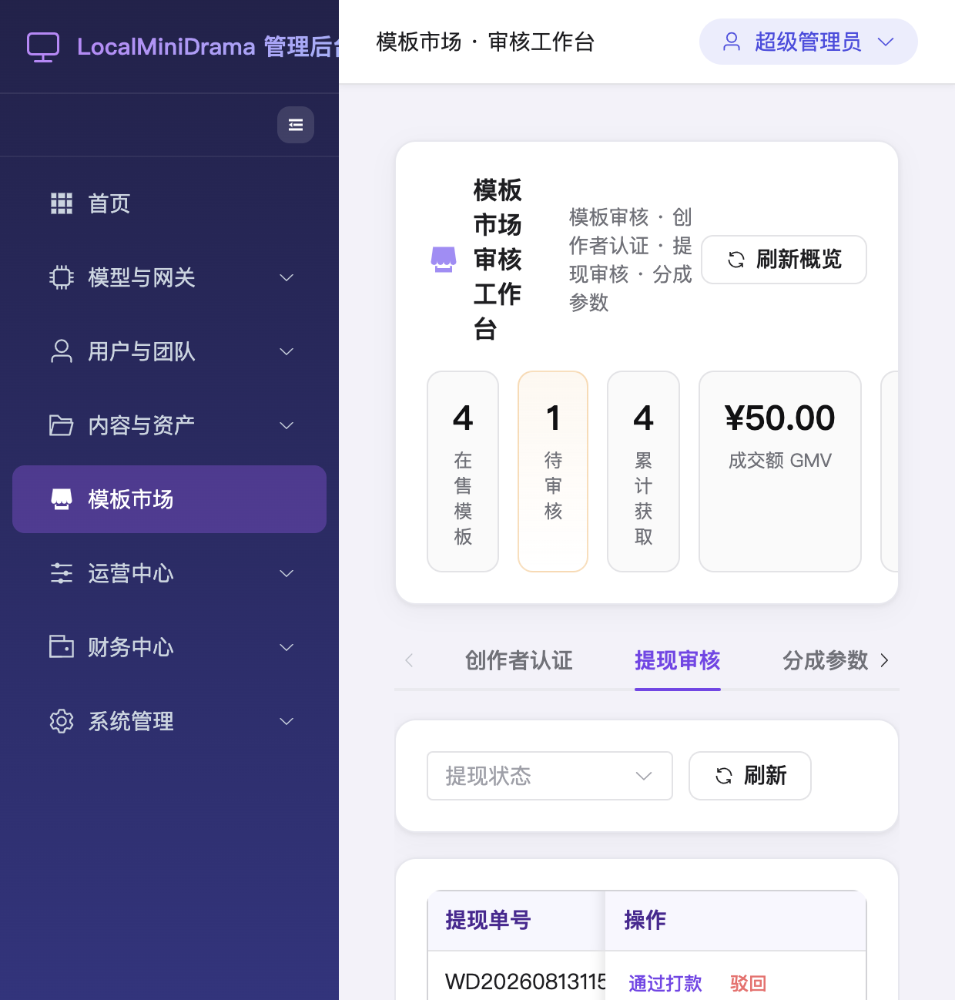
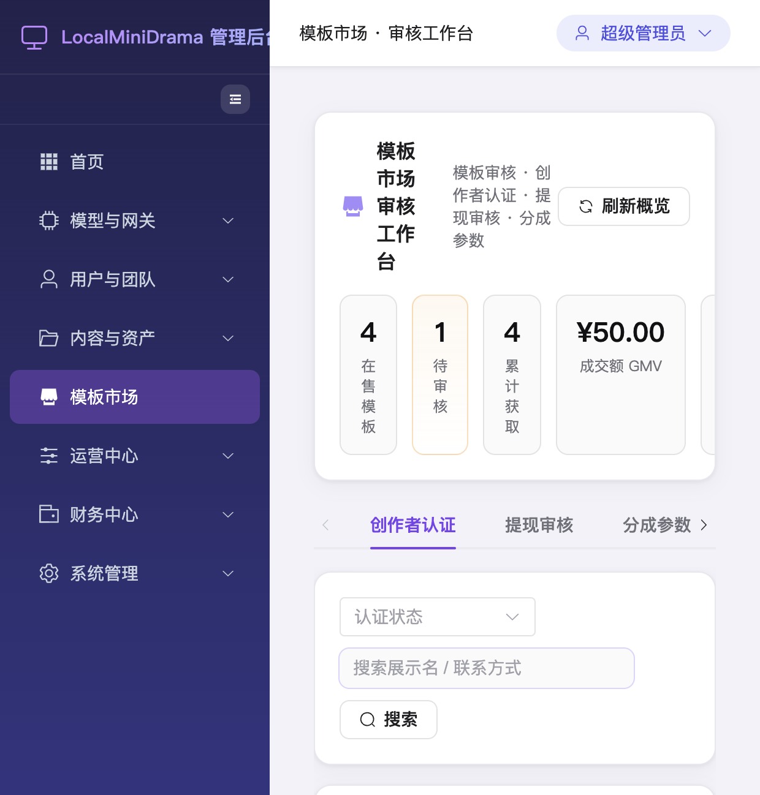

# Sprint 14 · 模板市场（创作者生态）验收报告

> 生成时间：2026-08-13 · 数据库：本地真实 MySQL · 环境：前后端本地开发服务
> 用途：周报同步 —— 单元测试 + 前端交互实测记录（含关键截图与日志摘要）

---

## 一、本轮验收结论

| 维度 | 结果 |
| --- | --- |
| 数据库迁移 | ✅ `50_s14_template_marketplace.sql` 幂等执行成功（8 张核心表） |
| 后端单元测试 | ✅ **29 / 29 通过**，6 个测试套件，0 失败（真实 MySQL，无 mock） |
| 前端交互实测 | ✅ 用户端「模板市场 / 创作者中心」+ 管理端「审核工作台」全链路可视验证 |
| 演示数据 | ✅ 已播种：2 认证创作者 · 4 上架模板 · 1 待复审 · 1 待审核提现 |

> ⚠️ **过程说明（重要）**：首轮测试因共享 MySQL 库中残留了演示脚本写入的积分（`seed_s14_demo`）与压测残留（`stress_test`），污染了「付费购买」用例的买家初始余额，导致 2 个子用例失败。已在 `test/s14TemplateMarketplace.test.js` 的 `cleanup()` 中补充清理这两类脏数据后，复跑 **29/29 全绿**。此为测试数据隔离问题，非产品代码缺陷。

---

## 二、后端单元测试摘要

**执行命令**

```bash
cd backend-node && node --test test/s14TemplateMarketplace.test.js
```

**测试套件结果**

| # | 测试套件 | 覆盖任务 | 结果 |
| --- | --- | --- | --- |
| 1 | 创作者入驻与认证 | S14-T03（申请/审核/驳回/专属分成比例/守卫） | ✅ ok |
| 2 | 模板审核流程 | S14-T04（提交→AI 预审→人工复审→上下架→轨迹） | ✅ ok |
| 3 | 模板列表 / 详情 / 免费下载 / 评分 | S14-T01（列表·分类·搜索·排序·评分聚合） | ✅ ok |
| 4 | 付费购买与收益分成 | S14-T05（积分抵扣·幂等·防自购·专属比例结算） | ✅ ok |
| 5 | 提现申请与审核 | S14-T03/T05（门槛/余额校验·冻结·打款·驳回退款） | ✅ ok |
| 6 | 市场概览与平台参数 | 四维聚合统计·平台分成比例回落·专属比例优先 | ✅ ok |

**统计汇总**

```text
# tests 29
# suites 6
# pass 29
# fail 0
# cancelled 0
# skipped 0
# todo 0
```

---

## 三、数据库迁移摘要

`50_s14_template_marketplace.sql` 采用 `CREATE TABLE IF NOT EXISTS` 幂等执行，后端启动时自动应用（日志 `Ran migration: 50_s14_template_marketplace.sql #1 ~ #9`）。

新增 8 张核心表：

| 表名 | 用途 |
| --- | --- |
| `marketplace_creators` | 创作者入驻与认证、收款账户、专属分成比例 |
| `marketplace_templates` | 模板主体、定价、状态机（draft→pending→ai_passed→listed…） |
| `marketplace_ratings` | 模板评分（仅已获取者可评、一人一评） |
| `marketplace_downloads` | 获取/下载记录、应用到剧目关联 |
| `marketplace_review_logs` | 审核轨迹（状态流转 + 备注 + 审核人） |
| `marketplace_settlements` | 分成结算（平台/创作者拆分、幂等） |
| `marketplace_creator_ledger` | 创作者收益流水（income/withdraw 双向记账） |
| `marketplace_withdrawals` | 提现申请与审核（冻结/打款/驳回退款） |

---

## 四、前端交互实测（截图）

> 截图目录：`docs/reports/s14-screenshots/`
> 服务：后端 `:5679` · 用户端 `:3013` · 管理端 `:3014`

### 4.1 用户端 · 模板市场画廊

概览卡：**4 在售模板 · 4 累计获取 · 2 认证创作者**；支持价格/最新排序、分类筛选（都市 2 / costume 1 / life 1）、关键词搜索。



### 4.2 用户端 · 模板详情弹窗

纯白背景弹窗，含封面轮播、标签、创作者、定价（免费）、**4.0 分 · 1 条评价 · 1 次获取**、模板包含（角色预设 2 / 场景预设 1 / 含风格配置）、详细介绍与用户评价，并提供「免费下载 / 购买」入口。



### 4.3 用户端 · 创作者中心

创作者仪表盘（晚风工作室 · 已认证）：可提现余额 ¥1.00 · 累计收益 ¥16.00 · 已提现 ¥0.00 · 销售订单/上架模板 1/2；含「我的模板 / 收益流水 / 提现记录」三个页签及编辑资料、申请提现、新建模板等操作。



> 收益流水（页签内实测数据）：
> - `收益入账 +16.00 → 余额 16.00`（模板销售分成，订单 TP…0242E3）
> - `提现出账 -15.00 → 余额 1.00`（提现申请 WD…9E4F7B）

### 4.4 管理端 · 审核工作台（概览 + 模板审核队列）

概览：**4 在售 · 1 待审核 · 4 累计获取 · GMV ¥50.00 · 平台分成收入 ¥13.00 · 2/2 认证创作者**；四页签：模板审核 / 创作者认证 / 提现审核 / 分成参数。



### 4.5 管理端 · 模板人工复审弹窗

纯白背景弹窗，展示 **AI 预审结果**（合规综合分 100.0/100 · 结论「通过（待人工复核）」· 未检出风险片段）、模板内容（角色预设 2 / 场景预设 1 / 风格配置已配置）、**审核轨迹**（草稿→待审核→AI 通过）与「驳回 / 通过上架」操作及审核意见输入。



### 4.6 管理端 · 提现审核

展示待审核提现单（提现单号 / 创作者 / 金额 / 收款账户 / 申请时间 / 状态）及「通过打款 / 驳回」操作。



### 4.7 管理端 · 创作者认证

创作者列表含收款渠道、**分成比例**（光影叙事 默认 70% · 晚风工作室 专属 80%）、上架/收益（2 个 / ¥21.00、2 个 / ¥16.00）与认证状态，支持「调整」分成比例。



---

## 五、后端接口日志摘要（实测调用链）

以下为本次前端点击操作真实触发的后端请求（节选自后端运行日志）：

```text
# 用户端 · 模板市场
GET /api/v1/marketplace/stats
GET /api/v1/marketplace/categories
GET /api/v1/marketplace/templates
GET /api/v1/marketplace/templates/36            # 模板详情弹窗

# 用户端 · 创作者中心
GET /api/v1/marketplace/creator/me
GET /api/v1/marketplace/creator/earnings
GET /api/v1/marketplace/creator/templates
GET /api/v1/marketplace/creator/ledger          # 收益流水页签

# 管理端 · 审核工作台
GET /api/v1/admin/marketplace/review-queue
GET /api/v1/admin/marketplace/templates/37       # 复审弹窗
GET /api/v1/admin/marketplace/templates/37/review-logs   # 审核轨迹
GET /api/v1/admin/marketplace/withdrawals        # 提现审核
GET /api/v1/admin/marketplace/creators           # 创作者认证
```

**市场概览接口实测返回**（`GET /api/v1/marketplace/stats`）：

```json
{
  "templates":   { "total": 5, "listed": 4, "in_review": 1, "paid": 2 },
  "transactions":{ "downloads": 4, "purchases": 2, "gmv": 50 },
  "revenue":     { "platform_income": 13, "creator_income": 37 },
  "creators":    { "total": 2, "approved": 2 },
  "platform_rate": 0.3
}
```

---

## 六、演示数据说明

演示数据由 `backend-node/scripts/seed_s14_marketplace_demo.js` 播种，包含：

- 认证创作者：**晚风工作室**（专属分成 80%）、**光影叙事**（默认分成 70%）
- 上架模板：都市甜宠·高糖速热、职场逆袭·爽感叙事、古风悬疑·雾锁重楼、治愈日常·慢生活
- 待复审模板：待审核·校园青春（AI 预审 100 分，等待人工复核）
- 待审核提现：¥15 一笔（用于演示提现审核）

复现/清理命令：

```bash
# 播种演示数据
cd backend-node && node scripts/seed_s14_marketplace_demo.js
# 清理演示数据
cd backend-node && node scripts/seed_s14_marketplace_demo.js --clean
```

> 注意：`node --test test/s14TemplateMarketplace.test.js` 的 `after()` 会清理测试相关数据（含复用的真实用户 2/3/4 的创作者与积分记录），跑完测试后如需继续前端演示，请重新执行播种脚本。
